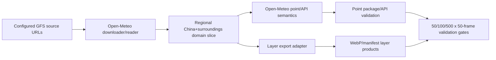

# Open-Meteo Engine Migration Design

Date: 2026-06-25

## Goal

Move the Singapore weather server from the private Python Open-Meteo-parity
implementation to a public AGPL repository that directly uses the Open-Meteo
engine. The old private repository remains read-only reference material. The
new server excludes satellite processing and keeps only weather-model, point,
layer, and validation responsibilities.

## Compliance Requirements

- The new repository is public and AGPL-3.0-or-later.
- Keep Open-Meteo `LICENSE` in the repository.
- Keep `UPSTREAM.md` with upstream repository, commit, SDK commit, and local
  change boundaries.
- Do not copy Open-Meteo into a closed-source service wrapper.
- Do not modify or push `89199156-design/weather_server_gfs`.
- Do not involve other internal repositories or non-Singapore servers.

Commercial use is acceptable under AGPL, but the running network service must
make the corresponding modified source available.

## Current Evidence

New repository:

- `89199156-design/weather_forecast_server`
- public, empty at migration start
- default branch: `main`

Old reference repository:

- `89199156-design/weather_server_gfs`
- private, read-only for this migration
- reference commit: `fe6d0e246d43c134221cef1a5554bc73162d47b8`

Singapore server:

- old path: `/opt/1panel/apps/weather`
- current remote: `git@github.com:89199156-design/weather_server_gfs.git`
- current old HEAD observed: `fe6d0e2 Document GFS alignment completion audit`
- Open-Meteo checkout observed:
  `open-meteo/open-meteo@d91c52f00665bb8ddd348f688fece556c933ffbb`
- SDK checkout observed:
  `open-meteo/sdk@e6274cf9e10240b98219b16cf63cf0fae73347d9`

Old repository file scope:

- Satellite files to exclude: 38 tracked files matching GK2A, JAXA, L2,
  Himawari/AWS H09, satellite temporal pack, and satellite systemd units.
- Weather/tooling files to consider: 115 tracked files matching GFS, CAMS,
  cloudsea, glow, point package, Open-Meteo comparison, layer verification,
  runtime resources, and weather task scripts.

## Architecture

The new repository is an Open-Meteo-derived server with local integration
layers, not a Python clone of Open-Meteo logic.

Open-Meteo remains responsible for:

- GFS model reader behavior;
- `gfs_global`/`gfs013` composition and fallback semantics;
- weather-code derivation;
- interpolation and grid-point selection;
- unit conversion and output precision.

Local code remains responsible for:

- China and surrounding-region boundaries;
- lightweight raw download source selection and slicing;
- client point-package export;
- layer manifest/WebP export;
- Singapore task orchestration;
- parity validation reports.

## Domain And Data Source

Initial local domain should preserve the existing production region unless a
source audit proves a better Open-Meteo-native slice:

- longitude: `70.0` to `140.0`
- latitude: `0.0` to `58.0`
- source grid: Open-Meteo GFS013 where available
- composite model target for point parity: `gfs_global`

GFS downloads must use configurable source URLs. The default configuration
should support our own mirror/download link, while retaining Open-Meteo's
variable, level, run, and forecast-hour semantics.

## Point API Migration

The first implementation target is point parity.

Do not port `openmeteo_weather_logic.py` as a source of truth. It may be kept
temporarily only as validation reference until Open-Meteo-driven outputs pass
the gates. Point results must come from Open-Meteo source paths.

Required point comparison gates:

1. 50 points x 50 forecast frames.
2. 100 points x 50 forecast frames.
3. 500 points x 50 forecast frames.

Stop at the first failing gate. Record:

- migrated code version;
- changed files;
- test command and report path;
- mismatch summary;
- source-chain analysis;
- required source-code correction before the next gate.

## Layer Migration

Layer migration should not start by copying the old Python layer logic as the
final design. The better target is to export layers from the same
Open-Meteo-derived data used by points.

Old Python layer code can be used as:

- output format reference;
- manifest schema reference;
- WebP encoding reference;
- validation-tool reference.

It must not remain the weather-rule authority.

Required layer checks:

- layer fields use the same run/batch as point fields;
- point-grid sampled layer values match point package values;
- 50, then 100, then 500 points x 50 forecast frames pass after point parity
  is complete.

## Satellite Removal

The new repository must exclude satellite modules and tasks:

- `aws_h09_l2_*`
- `gk2a_*`
- `jaxa_*`
- `l2_jaxa_*`
- `l2_kma_gk2a_*`
- `satellite_temporal_pack_v2/`
- `satellite_v2_consistency.py`
- `systemd/satellite-temporal-pack-v2.*`
- old satellite task scripts and generated satellite data directories

On Singapore, old satellite code/data/tasks can be removed only after the new
weather deployment path is staged and the old code has been backed up or is
recoverable from the old read-only repository.

## Implementation Phases

1. Repository bootstrap:
   Add AGPL license, upstream record, migration design, and ignore rules.

2. Open-Meteo baseline:
   Import Open-Meteo source at `d91c52f00665bb8ddd348f688fece556c933ffbb`.
   Keep upstream path and local patches auditable.

3. Local integration layer:
   Add regional-domain configuration and configurable GFS source URL support.
   Keep changes small and documented.

4. Point export:
   Build point output using Open-Meteo reader/API semantics and export the
   existing client package/API shape.

5. Layer export:
   Export layer products from the same Open-Meteo-derived arrays used by
   point output. Keep old Python render code only where it is purely product
   packaging.

6. Singapore deployment:
   Stage the new repository in a new path, switch task entrypoints, then
   remove old satellite tasks/code. Do not push to the old repository.

7. Validation:
   Run point and layer validation in the required 50/100/500 x 50-frame order.

## Non-Goals

- No closed-source derivative of Open-Meteo.
- No continued Python weather-rule clone as the production authority.
- No satellite processing in the Singapore weather server.
- No changes to the old `weather_server_gfs` remote.
- No access to unrelated internal repositories or other servers.
